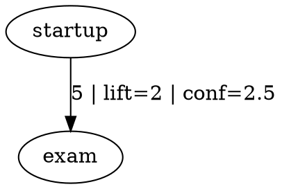

# Influnet

Influnet is a deterministic influence engine built on top of Captanet snapshots.

Version: `v0.0`

It answers:

`What led to what?`

Given ordered Captanet activities or sessions, Influnet detects directional transitions, filters weak or noisy edges, and produces ranked influence chains with CLI-friendly outputs.

## What It Does

- reads Captanet snapshot exports
- normalizes fragmented activity labels into canonical activity types
- detects directional `A -> B` transitions
- computes transition count, `P(B | A)`, `P(B)`, lift, and confidence
- suppresses weak bidirectional noise
- emits JSON, readable graph lines, DOT graphs, and neutral deterministic insights

## Why It Exists

Captanet explains what happened in a memory stream.

Influnet sits one layer above that and asks whether certain kinds of activity repeatedly tend to precede other kinds of activity.

The logic is deliberately deterministic:

- no LLM reasoning
- no probabilistic guessing
- no hidden model training
- the same input yields the same output

## Relationship To Captanet

- Captanet answers: `What happened?`
- Influnet answers: `What led to what?`

Influnet does not read Captanet internals directly.

It consumes only the public Captanet snapshot contract:

- `events`
- `sessions`
- `activities`

See the Captanet API contract in the Captanet repository for the public boundary.

## High-Signal Rules

Influnet keeps a chain only when it survives all of these checks:

- `count(A -> B) >= 3`
- `count(A) >= 5`
- the transition falls within the configured time window
- `P(B | A) > P(B)`
- the edge is directionally stronger than its reverse
- it remains in the top output set after confidence ranking

Confidence is ranked as:

```text
count(A -> B) * (P(B | A) - P(B))
```

This keeps ranking tied to both repetition and actual directional signal.

## Activity Normalization

Influnet includes a deterministic normalization layer for fragmented labels.

Examples:

- `Reading about startup` -> `startup`
- `Startup podcast` -> `startup`
- `Founder interview` -> `startup`
- `Exam revision notes` -> `exam`

The default rules live in `src/engine.mjs` and can be extended without changing Captanet.

## Terminal Quickstart

Prerequisites:

- Node.js `20+`
- npm `10+`

Install:

```powershell
npm install
```

Run the repository validation pass:

```powershell
npm run check
```

Run the included sample snapshot:

```powershell
npm run sample
```

Analyze any Captanet snapshot:

```powershell
npm run analyze -- --input <path-to-captanet-snapshot.json> --format all
```

Use mode-level analysis instead of activity keys:

```powershell
npm run analyze -- --input <path-to-captanet-snapshot.json> --field mode --format insights
```

Control support thresholds:

```powershell
npm run analyze -- --input <path-to-captanet-snapshot.json> --min-count 3 --min-source-count 5 --top 3
```

Direct CLI invocation also works:

```powershell
node src/cli.mjs --input examples/sample-captanet-snapshot.json --format all
```

## Programmatic Use

Influnet can also be embedded into other Memact-controlled projects as a deterministic analysis module:

```js
import {
  analyzeInfluenceSnapshot,
  formatReadableGraph,
  formatReadableInsights,
  formatDotGraph,
} from "influnet";
```

Recommended integration pattern:

1. Export a Captanet snapshot from the upstream system.
2. Pass that snapshot to `analyzeInfluenceSnapshot(...)`.
3. Render `valid_chains` or `insights` in your app, CLI, dashboard, or report layer.

## Sample Output

Graph:

```text
[startup] -> [exam] (5) lift=2 confidence=2.5
```

Insight:

```text
After engaging with startup-related content, you tended to move toward exam-related content. This pattern appeared 5 times within 45 minutes.
```

DOT:



## Input Contract

Influnet reads a Captanet snapshot shaped like:

```json
{
  "activities": [
    {
      "id": 1,
      "key": "startup",
      "label": "Reading about startup",
      "started_at": "2026-04-03T08:00:00.000Z",
      "ended_at": "2026-04-03T08:12:00.000Z"
    }
  ]
}
```

## Embedding And Reuse

Technical answer:

- yes, Influnet is structured to be reused consistently as a CLI or imported analysis module
- its stable integration surface is the Captanet snapshot contract plus the exported engine functions

License answer:

- the current repository license is proprietary
- that means you can reuse Influnet inside your own Memact-controlled projects
- it is not currently licensed for open third-party embedding, redistribution, or open-source reuse

If you want truly open embedding across external projects, the license would need to change.

## License

This repository uses the same license text as the original Memact codebase.

See `LICENSE`.
